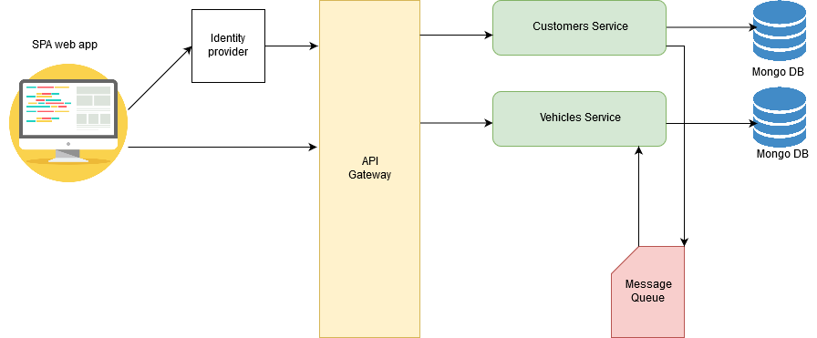
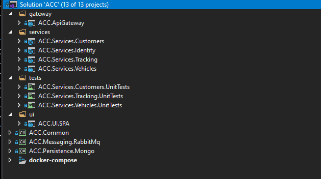
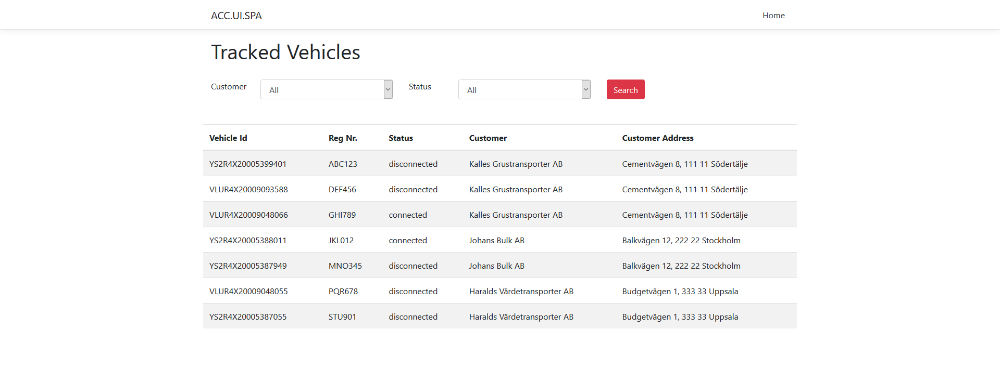

### ACC

**ACC** is a simple vehicles connectivity tracking system based on a simplified microservices architecture and docker containers.

Using **ACC** you can track a number of vehicles by periodically sending a ping request to these vehicles. Vehicle has a status of "connected" if it responds to ping request, otherwise it's disconnected.

### Architecture overview

**ACC** is a cross platform application since it's build using .net core and docker containers.
It consists of multiple autonomous microservices each one has its own database and uses message queue (RabbitMQ) for inter service communications.

- **Vehicles Service**: it's resposible for managing and storing vehicle information such as vehicle id, registeration number and some info about its owner that's represented in the system as a <b>Customer</b> such as name and address. To reduce interservice communications, it's recommended to duplicate some data across different services.

- **Customers Service**: it's responsible for storing vehicle owner info who is considered as a customer for ACC stackholders. it exposes a simple GRUD operations to add, update, get or delete customer.

- **Tracking Service**: it's where core business logic is implemented. it's responsible for sending ping request to each vehicle periodically and update state according to received status.
Since there are no real vehicles available that can respond to your "ping" request, [Ping Sender Simulator](src/common/Ping/PingSenderSimulator.cs) can be used to return a random ping reply.

- **API Gateway**: it acts as an aggregator and gateway to be consumed by external applications.

- **RabbitMQ** is used to maintain consistency between services, for example when customer service updates customer address, a <b>CustomerAddressUpdatedEvent</b> is published with the new address so that interested services such as <b>Vehicles service</b> updates that customer address.

### Overview of the application code

### Storage

All services use <b>mongo</b>. since each service manages its own data, different data storage mechanisms can be used. 
For example Tracking service may use **Redis** for fast access to tracked vehicles.

### UI

A <b>reactjs</b> single page application which contains only one screen to display tracked vehicles.

The changes which occure to vehicle status in the server isn't pushed to client so the client has to pull new data periodically by clicking search button.
When vehicle status changes <b>Tracking service</b> publishes VehicleStatusChangedEvent. this event may be used to instantly push that change to client using any real time communication framework/library such as SignalR.

### Used Techonlogies/Tools/Frameworks:

- Microsoft Visual Studio Comuunity 2019 Version 16.3.1.
- Robo 3T 1.3.1 (MongoDB management tool)
- Docker desktop community Version 2.1.3.0
- Git
- .Net core 3.0
- .NET Standard 2.1
- C# 8
- C# mongo driver
- Swagger
- Nunit & NSubstitute
- ReactJS

### Software requirements to set up development environment

- Visual Studio 2019 version 16.3 or later [vs 2017 doesn't support .NET Standard 2.1 or .NET Core 3.0](https://docs.microsoft.com/en-us/dotnet/core/whats-new/dotnet-core-3-0)
- Latest .NET Core 3.0 SDK from [https://www.microsoft.com/net/download](https://www.microsoft.com/net/download)
- Docker Community Edition.

### Docker compose deployment

- Docker-compose.yml contains the definition of all images needed for running application which includes mongo & rabbitmq images.
- Use docker-compose up command to create and start containers.

### Suggested enhancements

This application isn't production ready. It's simple enough & sufficient (I hope) for the purpose I created it for.
However, there are many things to worry about if you want to create a production ready microservices application such as:

- Configuration, secrets, network locations of external services such as database and message brokers (running them in containers is a bad idea).
- Health checks
- Logging
- Metrics
- Consistency 
- Load balancing
- Retry
- Versioning

  

 